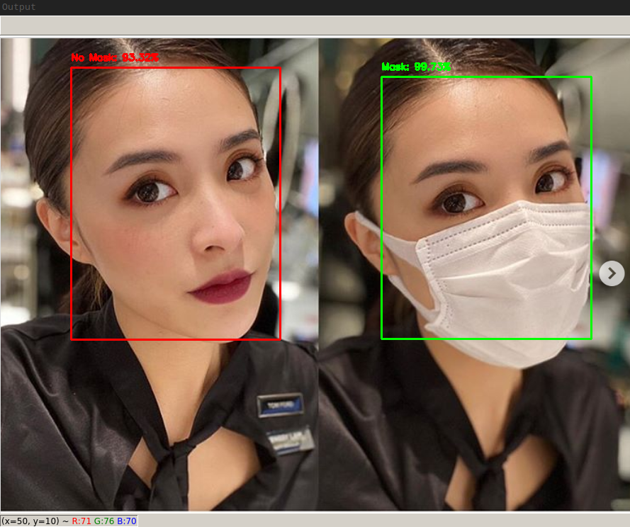

face-mask-detector
----------------------




[](https://github.com/senofsky/face-mask-detector/issues)

A library and tool for detecting face masks in images and video streams

Installation
---------------

To install `face-mask-detector` from source, clone this repository and run the
following in the project root directory:

```
pip install -e '.[dev]'
```

As always, the usage of a python [virtual
environments](https://docs.python.org/3/tutorial/venv.html) is recommended for a
development setup.

Quick Start
-------------

All commands are expected to be run in the project root directory.

To detect face masks in a image, run:

```
python scripts/detect_face_mask_in_image.py --image path/to/image
```

To start your webcam and detect face masks in the video stream, run:

```
python scripts/detect_face_masks_in_webcam_video_stream.py
```

To train the face-mask-detector model, run:

```
make model
```
